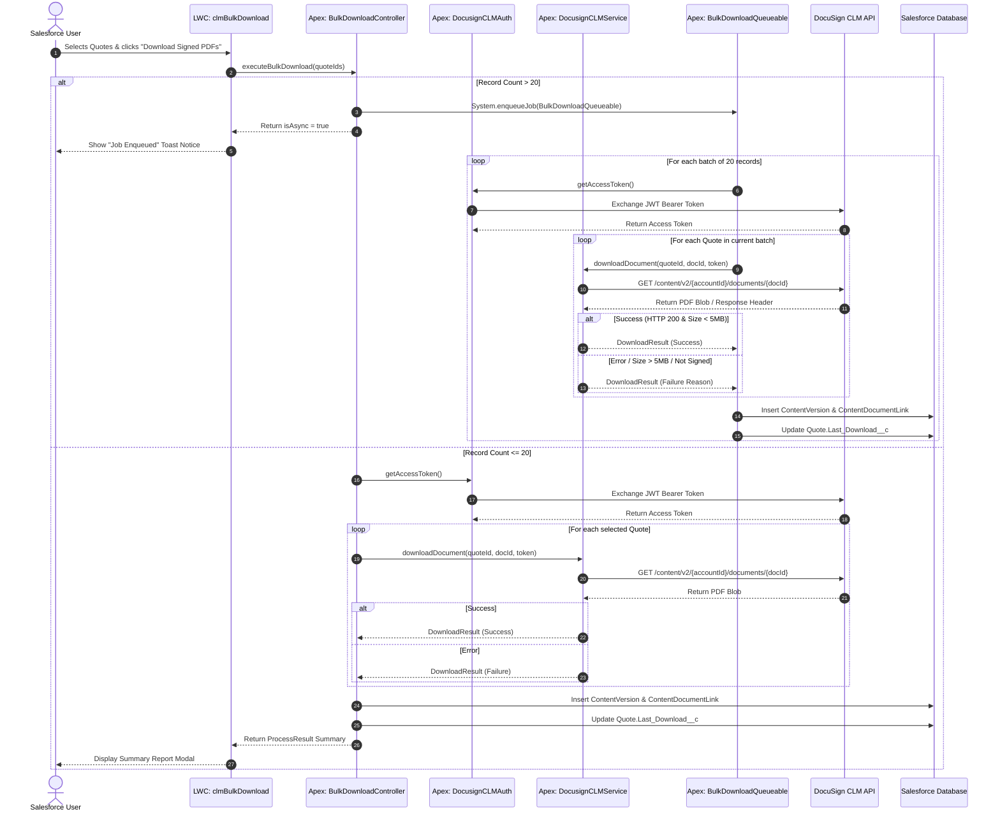

# DocuSign CLM Bulk Download for Salesforce (Managed Package)

This managed package integrates Salesforce Quotes with DocuSign CLM (Contract Lifecycle Management) to enable bulk downloading of signed PDFs directly from a Quote List View. It attaches each downloaded PDF directly to its respective Salesforce Quote record as a `ContentVersion` document and logs execution timestamps.

---

## 🏗 Architecture & Integration Flow

The package follows a decoupled, resilient architecture designed to remain within Salesforce Apex governor limits (e.g., maximum callout limits, heap size limits).



---

## 🚀 Setup & Installation Guide

Follow these step-by-step instructions to configure and deploy the solution.

### Step 1: DocuSign CLM Preparation
1. Log into your **DocuSign Admin Console**.
2. Navigate to **Integrations** > **Apps and Integration Keys**.
3. Create a new Integration Key or edit an existing one:
   - RSA Keypair: Generate an RSA Keypair and save the private key.
   - Redirect URIs: Add `https://login.salesforce.com` (or `https://test.salesforce.com`).
4. Ensure the administrative user grants consent for the scope: `signature extended`.

---

### Step 2: Salesforce Certificate & Key Setup
1. In Salesforce Setup, search for **Certificate and Key Management**.
2. Click **Create Self-Signed Certificate**:
   - **Label:** `DocuSign CLM JWT Cert`
   - **Unique Name:** `DocuSign_CLM_JWT_Cert`
3. Download the certificate file (`.crt`).
4. Upload this certificate to your DocuSign Integration Key under **RSA Keypairs**.

---

### Step 3: Remote Site Settings
Navigate to **Setup** > **Remote Site Settings** and add two remote sites:
1. **DocuSign Auth Endpoint:**
   - **URL:** `https://account.docusign.com` (or `https://account-d.docusign.com` for developer accounts)
2. **DocuSign CLM Content API Endpoint:**
   - **URL:** `https://api.na11.clm.docusign.net` (Replace `na11` with your region site domain).

---

### Step 4: Custom Metadata Configuration
Navigate to **Setup** > **Custom Metadata Types** > **DocuSign CLM Setting** > **Manage Records** and edit the `Default` record:

| Field Name | Description | Example Value |
| :--- | :--- | :--- |
| `Integration_Key__c` | DocuSign Integration Key (Client ID) | `a4e5f678-xxxx-xxxx-xxxx-xxxxxxxxxxxx` |
| `User_Id__c` | DocuSign API User GUID | `b2c3d456-xxxx-xxxx-xxxx-xxxxxxxxxxxx` |
| `Account_Id__c` | DocuSign Account ID | `12345678` |
| `Base_Url__c` | DocuSign CLM Base API URL | `https://api.na11.clm.docusign.net` |

---

### Step 5: Assign List View Button
1. Go to **Setup** > **Object Manager** > **Quote**.
2. Click **Buttons, Links, and Actions**.
3. Create a **New Action**:
   - **Action Type:** Lightning Web Component
   - **LWC:** `c:clmBulkDownload`
   - **Label:** `Download Signed PDFs from CLM`
4. Go to **List View Button Layout** and add the newly created button to the **Quote List View**.

---

### Step 6: Permission Set Assignment
Assign the **DocuSign CLM Admin** permission set to all users requiring access to the bulk sync tool:
```bash
sf org assign permset --name DocuSign_CLM_Admin
```

---

## 🛠 Deployment via Salesforce CLI (SFDX)

1. **Clone the repository:**
   ```bash
   git clone https://github.com/your-org/docusign-clm-sync.git
   cd docusign-clm-sync
   ```

2. **Authenticate with your target org:**
   ```bash
   sf org login web --set-default --alias my-target-org
   ```

3. **Deploy source to org:**
   ```bash
   sf project deploy start --target-org my-target-org
   ```

4. **Run Apex Tests:**
   ```bash
   sf apex run test --test-level RunLocalTests --wait 10 --result-format human
   ```

---

## ⚠️ Limits & Error Handling

- **Batch Size Limit:** Max 20 synchronous downloads per UI invocation to prevent Apex HTTP timeout and memory caps. Requests with $> 20$ records automatically queue as asynchronous jobs (`Queueable Apex`).
- **File Size Ceiling:** Standard maximum payload ceiling per PDF document is enforced at **5MB**. Any file exceeding this limit is flagged in error logs and skipped to prevent heap limit errors.
- **Missing Doc ID:** If a Quote record lacks a value in `Docusign_DocId__c`, the process logs an error and continues with the remaining selected items.
-  [](https://www.buymeacoffee.com/bhargavbhatt)
